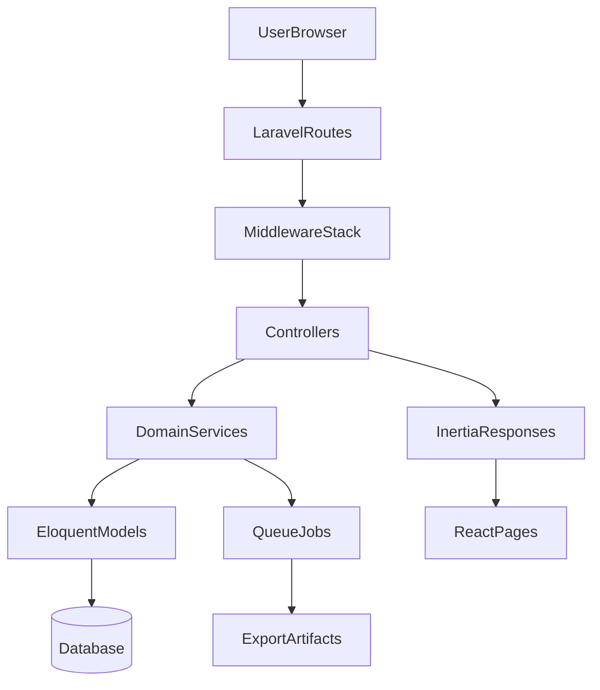

# 02 - Architecture

## Purpose

Provide a high-level and practical architecture map of FinCompta DZ.

## System Overview

FinCompta DZ uses:

- Backend: Laravel 13 (controllers, middleware, services, models)
- Frontend: Inertia.js + React pages/components
- Database: relational DB with migrations and seeders (PostgreSQL-friendly patterns)
- Queue: async report generation and background processing

## Request Layers

1. Route selection (`routes/web.php`, `routes/auth.php`)
2. Middleware gates (`auth`, `company`, `subscribed`, role/permission)
3. Controller action
4. Service-layer business rules
5. Eloquent persistence
6. Inertia response with page props

## Multi-Tenancy Model

- Company context is mandatory for most app features.
- Middleware sets/validates current company context.
- Most business queries are scoped by `company_id`.

## Domain-Driven Service Layer

Controllers stay thin where possible; reusable business logic lives in services such as:

- `JournalService`
- `ExpenseService`
- `SubscriptionService`
- `ReconciliationService`
- `VatReportService`
- `ReportRunService`

## Frontend Architecture

- `resources/js/app.jsx` initializes Inertia app and providers.
- `resources/js/Layouts/*` defines global shell/navigation.
- `resources/js/Pages/*` are route-bound pages.
- Shared flash/auth/subscription props are injected by `HandleInertiaRequests`.

## Async Architecture

- Heavy report exports are queued.
- Users are redirected to report runs page and poll status.
- Download endpoints are separately throttled.

## Beginner note

Architecture is how the app is organized internally; it does not change accounting rules but controls how reliably those rules are applied.

## Related Files

- `bootstrap/app.php`
- `app/Http/Middleware/HandleInertiaRequests.php`
- `resources/js/app.jsx`
- `routes/web.php`
- `app/Services/Reports/ReportRunService.php`

