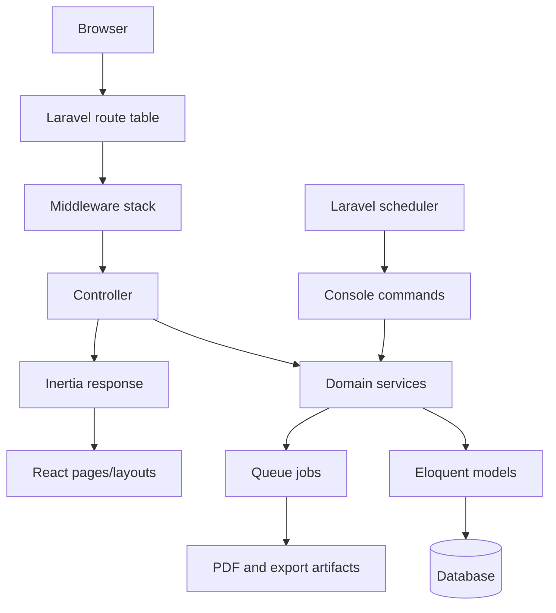

# 02 - Architecture

## Purpose

Document the current platform architecture in implementation-level detail, including new billing addons (scheduled subscription changes, manual payment approval workflow, and invoice PDF background generation).

## System Overview

FinCompta DZ is a multi-tenant SaaS accounting platform with:

- Backend: Laravel application layer (`routes`, middleware, controllers, services, models, jobs, console commands).
- Frontend: Inertia.js + React SPA pages backed by server routes.
- Data layer: relational schema with tenant-scoped records (`company_id`) and immutable accounting transitions.
- Async layer: queue workers for heavy artifact generation.
- Scheduled maintenance layer: Laravel scheduler for sweeping/report consistency and subscription scheduled-change enforcement.

## Runtime Layers (Request Path)

1. Route matching in `routes/web.php`.
2. Middleware composition (`auth`, `company`, `subscribed`, role/permission, throttles).
3. Controller orchestration (input validation + response shaping).
4. Service-layer business transitions (billing state machine, accounting invariants).
5. Eloquent persistence and related model behaviors/scopes.
6. Inertia payload hydration for React pages.

## Tenant and Access Architecture

### Tenant Context

- `currentCompany` is the current tenant anchor in runtime container state.
- Most domain reads/writes are hard-scoped by `company_id`.
- Billing routes require company context but intentionally do not require active subscription (recovery path by design).

### Access Gates

- `auth` and `verified` protect authenticated app flows.
- `subscribed` (`EnsureSubscriptionActive`) validates trial/active/grace states and now applies due scheduled plan/cycle changes before allowing access.
- `spatie_role` and `spatie_permission` protect global admin modules.

## Core Domain Service Architecture

### Billing/Subscription Services

- `SubscriptionService` centralizes all subscription transitions:
  - Trial bootstrap.
  - Payment success/failure state handling.
  - Immediate vs scheduled transitions (especially downgrade and yearly->monthly cycle change).
  - Token revocation after access-impacting state updates.
- `BillingController` is the orchestration entrypoint for:
  - Chargily checkout session creation.
  - Webhook verification + idempotent state update.
  - Manual transfer (Bon de commande) generation and proof upload flow.

### Invoicing Services

- `InvoiceService` handles line computations, totals, compliance validation, issuance, voiding and credit-note creation.
- Issuance dispatches `GenerateInvoicePdf` on queue `pdf` with `afterCommit()` to avoid race conditions.
- `Invoice` model enforces post-issuance immutability boundaries.

## Addon Architecture (New Components)

### Scheduled Subscription Change Addon

- New subscription fields (`next_plan_id`, `next_billing_cycle`, `next_change_effective_at`, `pending_change_reason`, `pending_change_requested_at`) support deferred transitions.
- Applied in two places:
  - Read-time guard in `EnsureSubscriptionActive` (if due and user hits app route).
  - Scheduled maintenance command `subscriptions:apply-scheduled-changes` for unattended enforcement.

### Manual Payment Approval Addon

- User uploads transfer proof from billing portal.
- Admin module (`Admin/Payments/Index`) handles confirm/reject actions.
- Double-approval threshold for large Bon de commande payments is enforced in `PaymentConfirmationController`.

### Global Notification UX Addon

- `NotificationProvider` wraps the Inertia app in `resources/js/app.jsx`.
- Unifies flash/error display and exposes modal-based `confirm()` and `prompt()` interactions used by admin billing actions.

## Async and Scheduler Architecture

### Queue Workloads

- Invoice PDF generation: `GenerateInvoicePdf` (queue `pdf`).
- Reporting exports: async report run architecture.

### Scheduler Workloads

- Report artifact retention sweep.
- Stuck report reaper.
- Scheduled subscription changes applier.

All write-oriented periodic tasks use overlap protection and explicit failure logging.

## Frontend Architecture

- App bootstrap: `resources/js/app.jsx`.
- Layout composition: `resources/js/Layouts/*`.
- Route pages: `resources/js/Pages/*`.
- Billing-related pages:
  - `Billing/Index.jsx`: subscription status, scheduled-change messaging, refunds, payment history.
  - `Billing/BonDeCommande.jsx`: transfer instructions + proof upload.
  - `Admin/Payments/Index.jsx`: manual payment triage and confirmation actions.

## Beginner note

Architecture is the "wiring" that makes accounting behavior reliable: who can access what, when payments change subscription state, and how sensitive operations run safely in background workers.

## Related Files

- `bootstrap/app.php`
- `routes/web.php`
- `routes/console.php`
- `app/Http/Middleware/EnsureSubscriptionActive.php`
- `app/Http/Controllers/BillingController.php`
- `app/Http/Controllers/Admin/PaymentConfirmationController.php`
- `app/Services/SubscriptionService.php`
- `app/Services/InvoiceService.php`
- `app/Jobs/GenerateInvoicePdf.php`
- `resources/js/app.jsx`

