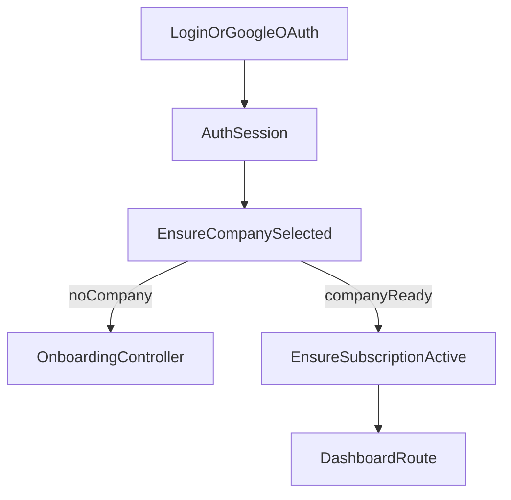

# 05 - Auth, Onboarding, and Company Context

## Purpose

Describe the user identity lifecycle from login through tenant selection, onboarding, and access gating into subscribed app routes.

## Concepts

- Authentication: who the user is.
- Verification: whether email is verified.
- Company context: which tenant the user is currently operating in.
- Onboarding: first company creation after first login.
- Subscription gate: whether tenant access is trial/active/grace eligible.

## User Flow

1. User logs in (classic auth or Google OAuth).
2. If no company exists, user is redirected to onboarding.
3. User creates first company and trial starts.
4. User lands in app with `currentCompany` context.
5. User can switch company via company selector.
6. App routes require subscription-active middleware; billing routes remain open for recovery.

## Technical Flow

Routes and handlers:

- OAuth: `GoogleOAuthController`
- Onboarding: `OnboardingController`
- Company switch: `CompanyController`
- Shared auth props: `HandleInertiaRequests`

## Route Boundary Model

### Public Boundary

- landing, legal, OAuth callback, webhook routes.

### Auth Boundary

- onboarding/company switcher,
- admin routes (global role/permission model),
- billing routes (with `company`, without `subscribed`).

### Subscribed App Boundary

- accounting and core business routes require:
  - `auth`,
  - `verified`,
  - `company`,
  - `subscribed`.

## Company Context Rules

- context is resolved server-side; tenant id must not be trusted from user input.
- `EnsureCompanySelected` redirects if context is absent.
- tenant-scoped models/services must use current context for reads/writes.
- switching company changes all downstream query scopes and permissions.

## Onboarding and Trial Bootstrap

- onboarding creates first company record.
- subscription trial is initialized through subscription service logic.
- trial duration and grace behavior are configuration-backed.

## Shared Frontend Auth Context

`HandleInertiaRequests` provides:

- authenticated user payload,
- roles/permissions,
- flash and errors,
- subscription summary and feature availability.

`NotificationProvider` in frontend bootstrap consumes flash/errors globally for consistent UX messaging.

## Edge Cases

- User authenticated but not verified: verification routes in `routes/auth.php`.
- User in multiple companies: must switch context before operating.
- Missing/invalid company context: redirected to selector or onboarding.
- Expired subscription: app routes blocked, billing remains accessible.
- Scheduled plan/cycle change due: applied before route continuation by subscription middleware.

## Developer note

Any new app feature requiring tenant data must live behind `company` middleware and should not infer company context from request body.

## Beginner note

Company context means “which business books you are currently editing.” Without this context, accounting actions are blocked to avoid writing data to the wrong company.

## Related Files

- `routes/auth.php`
- `routes/web.php`
- `bootstrap/app.php`
- `app/Http/Controllers/Auth/GoogleOAuthController.php`
- `app/Http/Controllers/OnboardingController.php`
- `app/Http/Controllers/CompanyController.php`
- `app/Http/Middleware/EnsureCompanySelected.php`
- `app/Http/Middleware/EnsureSubscriptionActive.php`
- `app/Http/Middleware/HandleInertiaRequests.php`
- `resources/js/app.jsx`

