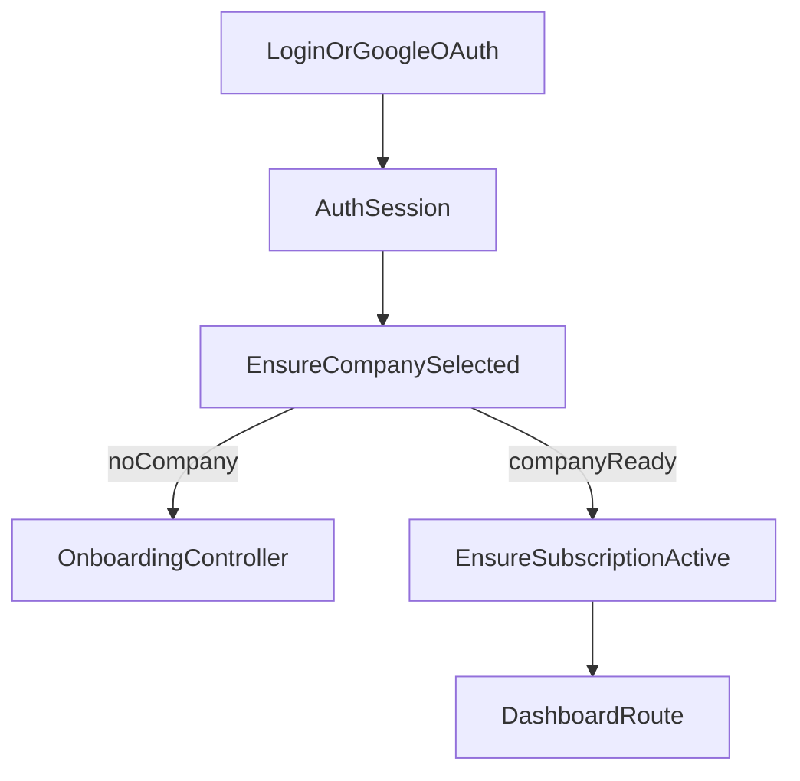

# 05 - Auth, Onboarding, and Company Context

## Purpose

Describe user access lifecycle from login to active company context.

## Concepts

- Authentication: who the user is.
- Verification: whether email is verified.
- Company context: which tenant the user is currently operating in.
- Onboarding: first company creation after first login.

## User Flow

1. User logs in (classic auth or Google OAuth).
2. If no company exists, user is redirected to onboarding.
3. User creates first company and trial starts.
4. User lands in app with `currentCompany` context.
5. User can switch company via company selector.

## Technical Flow

Routes and handlers:

- OAuth: `GoogleOAuthController`
- Onboarding: `OnboardingController`
- Company switch: `CompanyController`
- Shared auth props: `HandleInertiaRequests`

## Edge Cases

- User authenticated but not verified: verification routes in `routes/auth.php`.
- User in multiple companies: must switch context before operating.
- Missing/invalid company context: redirected to selector or onboarding.

## Developer note

Any new app feature requiring tenant data must live behind `company` middleware and should not infer company context from request body.

## Beginner note

Company context means “which business books you are currently editing.” Without this context, accounting actions are blocked to avoid writing data to the wrong company.

## Related Files

- `routes/auth.php`
- `routes/web.php`
- `app/Http/Controllers/Auth/GoogleOAuthController.php`
- `app/Http/Controllers/OnboardingController.php`
- `app/Http/Controllers/CompanyController.php`
- `app/Http/Middleware/EnsureCompanySelected.php`

