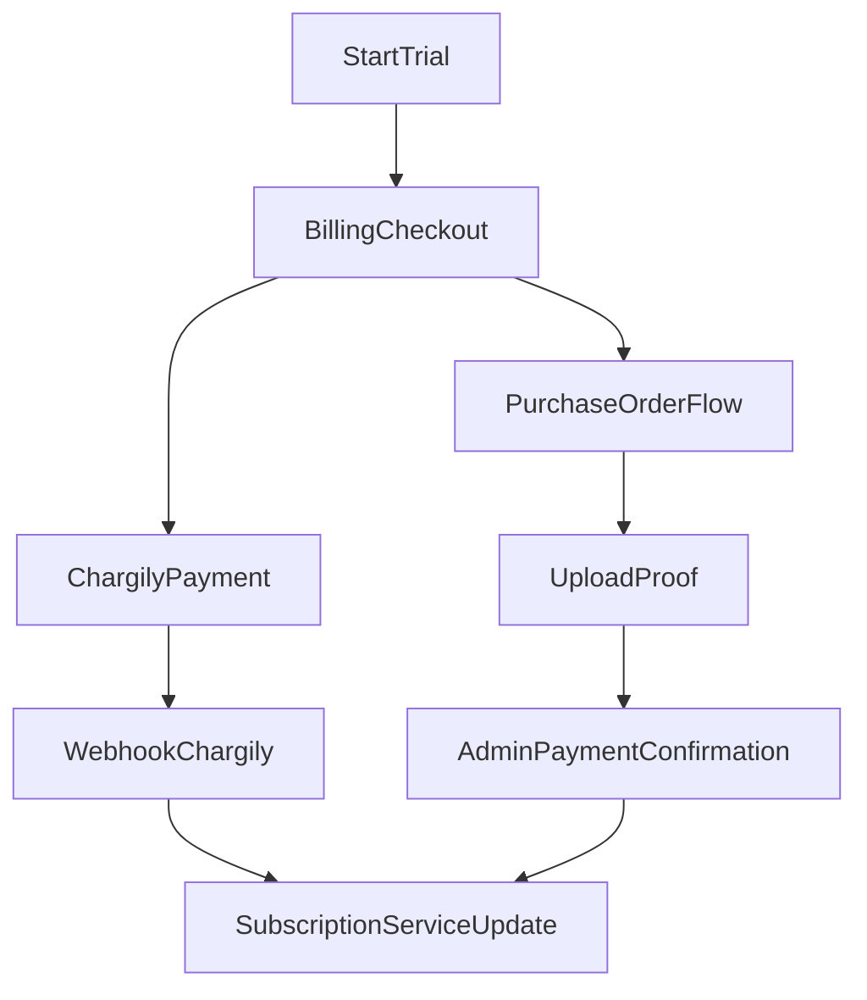

# 06 - Subscriptions, Billing, and Payments

## Purpose

Explain trial lifecycle, checkout methods, webhook handling, and admin payment operations.

## Concepts

- Plan: product tier and features.
- Subscription: active/trial/grace/past_due state for a company.
- Payment: transaction attempt linked to plan/cycle.
- Webhook: trusted payment status update from provider.
- Manual flow: purchase order and proof upload path.

## User Flow (Happy Path)

1. User starts trial.
2. User opens checkout (`/billing/checkout`).
3. User chooses Chargily or purchase order.
4. Payment result updates subscription.
5. User regains/keeps app access via `subscribed` middleware.

## Technical Flow

- Billing routes and handlers live in `BillingController`.
- Subscription state transitions are centralized in `SubscriptionService`.
- Chargily callbacks hit public webhook routes and are HMAC-verified.
- Manual transfer path stores payment as pending and requires admin confirmation.

## Admin Operations

- Confirm/reject payments.
- Review and update refund requests.
- Manage subscription state extensions/reactivations.

## Edge Cases

- Payment success page without confirmed webhook: pending state.
- Duplicate webhook events: idempotency expected through payment/event tracking.
- Subscription expired: app routes blocked but billing remains open.

## Beginner note

Subscription control is separate from accounting records: it governs platform access, not journal correctness.

## Developer note

Never trust front-end payment success alone. Use provider callbacks and signed verification before final state transitions.

## Related Files

- `routes/web.php`
- `app/Http/Controllers/BillingController.php`
- `app/Http/Controllers/RefundRequestController.php`
- `app/Http/Controllers/Admin/PaymentConfirmationController.php`
- `app/Http/Controllers/Admin/RefundRequestAdminController.php`
- `app/Services/SubscriptionService.php`
- `app/Services/ChargilyService.php`
- `app/Http/Middleware/EnsureSubscriptionActive.php`

