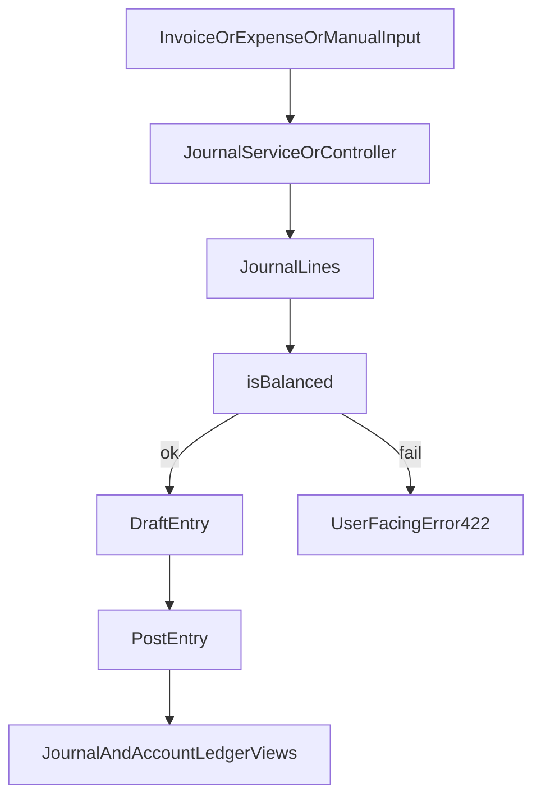

# 07 - Accounting Engine: Journals and Ledger

## Purpose

Explain how business events become balanced journal entries, how posting/locks are enforced, and how ledger/trial views are derived.

## Concepts

- Journal entry: grouped accounting event.
- Journal line: one debit or credit leg tied to an account.
- Balanced entry: sum(debits) = sum(credits).
- Posting: transition from draft to official state.
- Ledger: account-centric chronological history.
- Immutability boundary: posted/locked records restrict edits for audit safety.

## Main Processes

### Manual Entry

- Create/update/delete via `JournalEntryController`.
- Real-time balancing support in `Ledger/Entries/Create.jsx`.
- Optional immediate posting if constraints pass.

### Automated Entry from Expense/Invoice

- `ExpenseService` and `JournalService` generate draft entries.
- `InvoiceService` issuance flow triggers sales-entry drafting and downstream posting path.
- Account mapping and VAT logic split lines into proper accounts.
- Entry is rejected with business error if not balanced.

### Posting and Locks

- Posting endpoint checks period and state.
- Entry locks and period locks prevent late changes.

## Accounting Invariants (Must Hold)

- Every journal entry must remain balanced (`sum(debit) = sum(credit)`).
- Period lock or entry lock blocks prohibited mutations.
- Posting transitions are controlled by backend checks, not UI assumptions.
- Source-document transitions (issue/void/credit) must maintain legal accounting traceability.

## Technical Flow

## Source-to-Journal Pipelines

### Expense Confirmation Pipeline

- validates document and account mapping,
- computes VAT/account distribution,
- generates draft entry lines through accounting services,
- refuses confirmation when invariants fail.

### Invoice Issuance Pipeline

- compliance checks before issuance,
- invoice number assignment and snapshot capture,
- sales entry draft creation,
- asynchronous invoice PDF generation (separate concern from journal correctness).

### Invoice Void/Credit Pipeline

- voiding may require reversal entry logic,
- locked-period safeguards prevent illegal reversal timing,
- credit note creates controlled negative-flow commercial/accounting correction.

## User-Facing Screens

- Journal view
- Trial balance view
- Account ledger (`/ledger/account`)
- Manual entry create/edit pages

## Edge Cases

- Period closed -> posting blocked.
- Missing account mapping -> service fallback/default account rules.
- Inconsistent source totals -> unbalanced entry error.

## Beginner note

Every valid accounting action must keep equality between total debits and total credits. The app enforces this automatically.

## Developer note

Business invariants must remain in services/models/controllers; front-end checks are convenience only. Any new accounting mutation should specify: preconditions, reversible path (if needed), and lock behavior.

## Related Files

- `app/Http/Controllers/JournalEntryController.php`
- `app/Http/Controllers/LedgerController.php`
- `app/Http/Controllers/InvoiceController.php`
- `app/Services/JournalService.php`
- `app/Services/ExpenseService.php`
- `app/Services/InvoiceService.php`
- `app/Models/JournalEntry.php`
- `app/Models/JournalLine.php`
- `resources/js/Pages/Ledger/Entries/Create.jsx`
- `resources/js/Pages/Ledger/AccountLedger.jsx`

