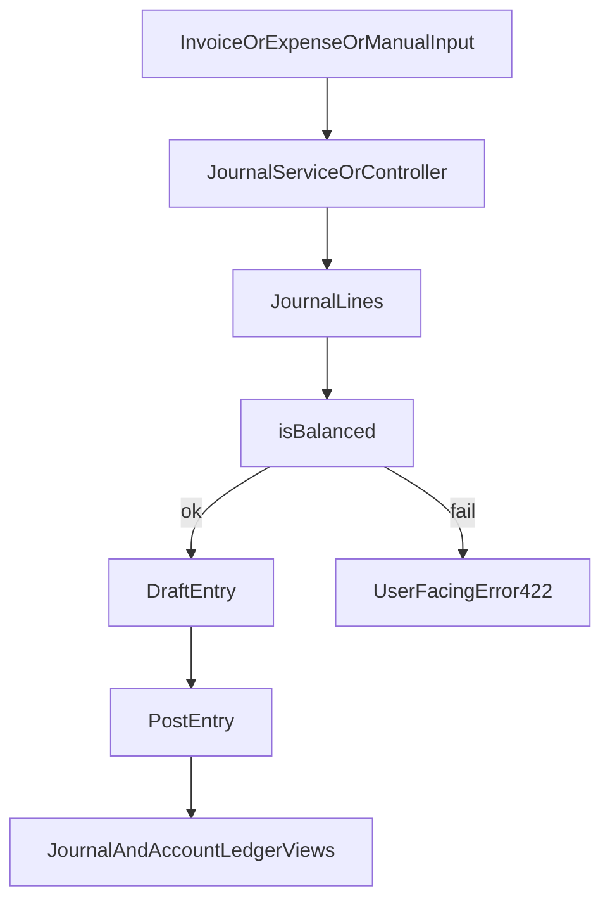

# 07 - Accounting Engine: Journals and Ledger

## Purpose

Explain how business events become journal lines and how ledger/trial views are built.

## Concepts

- Journal entry: grouped accounting event.
- Journal line: one debit or credit leg tied to an account.
- Balanced entry: sum(debits) = sum(credits).
- Posting: transition from draft to official state.
- Ledger: account-centric chronological history.

## Main Processes

### Manual Entry

- Create/update/delete via `JournalEntryController`.
- Real-time balancing support in `Ledger/Entries/Create.jsx`.
- Optional immediate posting if constraints pass.

### Automated Entry from Expense/Invoice

- `ExpenseService` and `JournalService` generate draft entries.
- Account mapping and VAT logic split lines into proper accounts.
- Entry is rejected with business error if not balanced.

### Posting and Locks

- Posting endpoint checks period and state.
- Entry locks and period locks prevent late changes.

## Technical Flow

## User-Facing Screens

- Journal view
- Trial balance view
- Account ledger (`/ledger/account`)
- Manual entry create/edit pages

## Edge Cases

- Period closed -> posting blocked.
- Missing account mapping -> service fallback/default account rules.
- Inconsistent source totals -> unbalanced entry error.

## Beginner note

Every valid accounting action must keep equality between total debits and total credits. The app enforces this automatically.

## Developer note

Business invariants should stay in service/model checks, not only in UI validation.

## Related Files

- `app/Http/Controllers/JournalEntryController.php`
- `app/Http/Controllers/LedgerController.php`
- `app/Services/JournalService.php`
- `app/Services/ExpenseService.php`
- `app/Models/JournalEntry.php`
- `app/Models/JournalLine.php`
- `resources/js/Pages/Ledger/Entries/Create.jsx`
- `resources/js/Pages/Ledger/AccountLedger.jsx`

