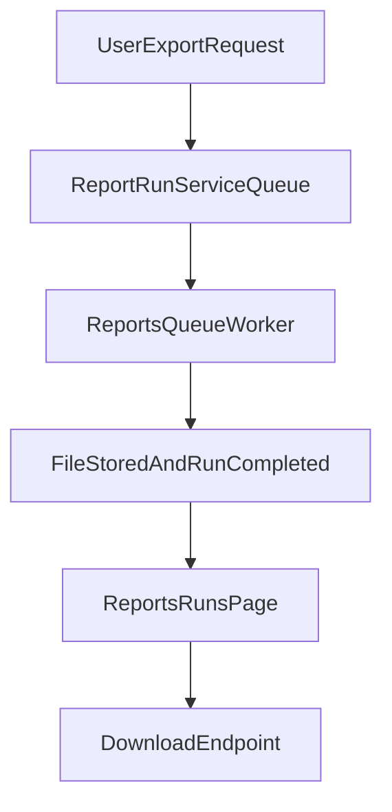

# 09 - Reports, VAT/G50, and Exports

## Purpose

Explain reporting modules, VAT/G50-oriented logic, asynchronous export architecture, and operational safeguards around report generation.

## Reports Covered

- VAT report
- Bilan
- Aged receivables/payables
- Analytic trial balance
- Management predictions
- Report runs index and downloadable artifacts

## VAT and G50 Positioning

- VAT computations are built by `VatReportService`.
- Tax rates include reporting metadata (`G50-L*`) used for compliance-oriented mapping.
- Current implementation focuses on VAT aggregation and exports; it is not a full standalone G50 form editor.

## Report Execution Modes

### Synchronous Views

- most report pages render computed summaries directly for browsing.

### Asynchronous Exports

- heavy exports are enqueued to background workers,
- `report_run` acts as lifecycle state record,
- users poll status and download artifacts when completed.

## Async Export Architecture

Large exports are queued:

1. User requests export.
2. App creates `report_run`.
3. Background job generates artifact.
4. User tracks status in report runs page.
5. User downloads final file.

## Report Run Lifecycle

Typical status progression:

- queued -> running -> completed, or
- queued/running -> failed.

Operational controls:

- retention sweep deletes old artifacts and stale rows,
- stuck-run reaper marks overlong "running" rows as failed for user recovery.

## Rate-Limit Protections

Exports and poll/download endpoints are throttled to protect worker capacity and bandwidth.

## Edge Cases

- User closes page during generation: run continues server-side.
- Job failure: run status records failure and message.
- Expired artifact: download fails gracefully and should be regenerated.
- Poll loops from multiple tabs are bounded by dedicated poll limiter.

## Beginner note

Reports summarize accounting records already posted. If source entries are wrong or missing, report outputs will reflect that.

## Developer note

New heavy reports should follow the existing `ReportRunService` + queue model instead of synchronous generation.

## Related Files

- `app/Http/Controllers/ReportController.php`
- `app/Http/Controllers/ReportRunController.php`
- `routes/console.php`
- `app/Services/VatReportService.php`
- `app/Services/BilanService.php`
- `app/Services/AnalyticReportService.php`
- `app/Services/Reports/ReportRunService.php`
- `app/Jobs/Reports/*`
- `app/Providers/RateLimiterServiceProvider.php`
- `resources/js/Pages/Reports/*`

